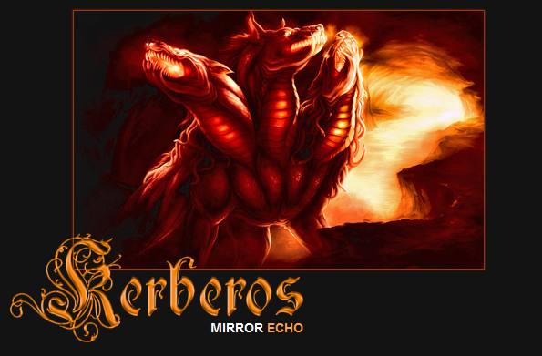

# 🛒 Welcome to **kerberos url**! 🚀

**kerberos url** is your gateway to secure online shopping. Enhanced by **kerberos market** technology, we provide the most advanced e-commerce experience.

## 🛍️ Key Features

Our **kerberos link** platform offers cutting-edge capabilities powered by:

- Seamless product discovery with **darknet link kerberos** search and personalized recommendations. Find exactly what you're looking for in seconds.
- Secure transactions via end-to-end encryption and fraud detection. Shop with confidence knowing your sensitive data is always protected.
- Decentralized marketplace using **link to kerberos market** for peer-to-peer transactions. Enjoy a trustless, transparent shopping experience.

## ✨ Benefits

Choose **darknet link kerberos** for these advantages:

- Ultimate privacy with zero-knowledge encryption and anonymous shopping. Keep your personal information completely confidential.
- Cryptocurrency support via **link to kerberos market** for fast, low-fee payments. Tap into the power of digital currencies for your purchases.
- Unmatched user experience using **kerberos darknet link** design principles. Enjoy intuitive navigation, sleek interfaces, and delightful interactions.

## 🚀 Getting Started ✨

Begin with **kerberos url** today:

1. Sign up securely using **darknet link kerberos** authentication. Create your account in just a few clicks with robust identity verification.
2. Fund your wallet with **darknet markets** or fiat currency. Add funds easily to start shopping right away.
3. Discover amazing products via personalized feeds and curated collections. Find hidden gems perfectly matched to your tastes.

## 🤝 Community ✨

Join the **kerberos market link** community today! Connect with fellow shoppers, get support from our helpful team, and shape the future of e-commerce. Together, we're revolutionizing online shopping. 🌟